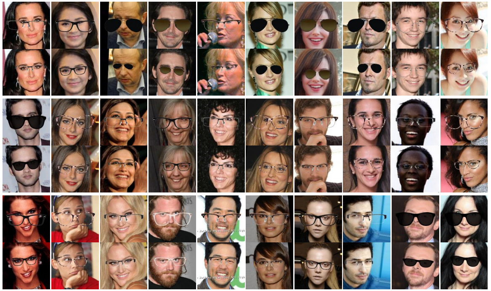

## ST-GAN: Spatial Transformer Generative Adversarial Networks for Image Compositing
[Chen-Hsuan Lin](https://chenhsuanlin.bitbucket.io/),
[Ersin Yumer](http://www.meyumer.com/),
[Oliver Wang](http://www.oliverwang.info/),
[Eli Shechtman](https://research.adobe.com/person/eli-shechtman),
and [Simon Lucey](http://www.simonlucey.com/)  
IEEE Conference on Computer Vision and Pattern Recognition (CVPR), 2018  

Project page: https://chenhsuanlin.bitbucket.io/spatial-transformer-GAN  
Paper: https://chenhsuanlin.bitbucket.io/spatial-transformer-GAN/paper.pdf  
arXiv preprint: https://arxiv.org/abs/1803.01837

<p align="center"></p>

We provide TensorFlow code for the following experiments:
- indoor object compositing
- glasses compositing

--------------------------------------

### Prerequisites

This code is developed with Python3 (`python3`). TensorFlow r1.0+ is required. The dependencies can install by running  
```
pip3 install --upgrade numpy scipy imageio termcolor tensorflow-gpu
```
If you don't have sudo access, add the `--user` flag.

### Dataset (indoor objects)  
The dataset (6.4GB) can be downloaded by running the command
```
wget https://cmu.box.com/shared/static/us4vjubhcgt5ziiikaw8kyowut1sopy5.gz
```
After downloading, run `tar -zxf us4vjubhcgt5ziiikaw8kyowut1sopy5.gz` under `indoor`. The files will be extracted to a directory `dataset`.

### Dataset (glasses)  
The following from the [CelebA](http://mmlab.ie.cuhk.edu.hk/projects/CelebA.html) dataset is required:
- Aligned & cropped images
- Attribute annotations
- Train/val/test partitions

After downloading CelebA, run `python3 preprocess_celebA.py` under `glasses` to convert the  train/test split to .npy format.  
(The variable `celebA_path` should be changed to the path where CelebA is downloaded)

### Pretrained model (indoor objects)
The pretrained model (89.6MB) can be downloaded by running the command
```
wget https://cmu.box.com/shared/static/ygl08wfsc2omutwrvra3u7zjjsu1ovwv.gz
```
After downloading, run `tar -zxf ygl08wfsc2omutwrvra3u7zjjsu1ovwv.gz` under `indoor`. The files will be extracted to a directory `models_0`.

### Pretrained model (glasses)
The pretrained model (121MB) can be downloaded by running the command
```
wget https://cmu.box.com/shared/static/5ad2lbjuvze9iey2up6hcisg6dctii4h.gz
```
After downloading, run `tar -zxf 5ad2lbjuvze9iey2up6hcisg6dctii4h.gz` under `glasses`. The files will be extracted to a directory `models_0`.

### Running the code

To train ST-GAN, run `./train.sh` under `indoor`/`glasses`.  
The checkpoints are saved in the automatically created directory `model_GROUP`; summaries are saved in `summary_GROUP`.  
The list of optional arguments can be found by executing `python3 train_STGAN.py --help`.  

To evaluate ST-GAN, run `./test.sh` under `indoor`/`glasses`.  
The output of ST-GAN will be saved in the directory `eval_GROUP` (automatically created).  
For glasses, you can also replace the `--loadImage` flag with the path to your file if you want to try with your own images (the image should be of size `144x144x3`).

### Visualizing the results  
We've included code to visualize the training over TensorBoard. To execute, run
```
tensorboard --logdir=summary_GROUP --port=6006
```

We provide three types of data visualization:  
1. **SCALARS**: training curves over iterations (not much meaningful)  
2. **IMAGES**: composite results  
3. **GRAPH**: network architecture

--------------------------------------

If you find our code useful for your research, please cite
```
@inproceedings{lin2018stgan,
  title={ST-GAN: Spatial Transformer Generative Adversarial Networks for Image Compositing},
  author={Lin, Chen-Hsuan and Yumer, Ersin and Wang, Oliver and Shechtman, Eli and Lucey, Simon},
  booktitle={IEEE Conference on Computer Vision and Pattern Recognition ({CVPR})},
  year={2018}
}
```

Please contact me (chlin@cmu.edu) if you have any questions!
